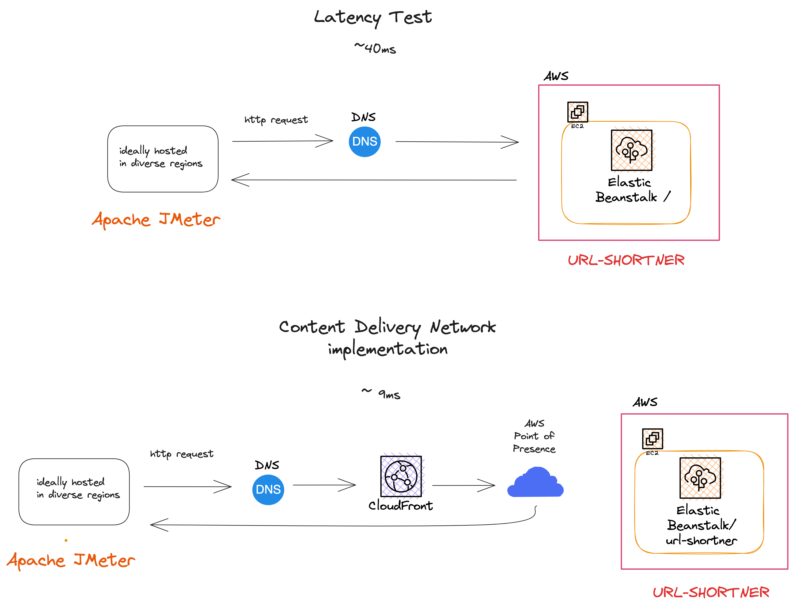

# Setting up a Content Delivery Network with AWS Cloudfront

**This repository walks through the implementation of a CDN for an Elastic Beanstalk Application**

## Content Delivery Network

A Content Deliver Network (CDN) is a network of servers strategically placed is geographically diverse location. The network of servers caches copies of content from your service and can serve this content. This reduces that round trip between a user and content from your application.

## Performance Testing
We tested a Flask Application hosted in an Elastic Beanstalk was tested for latency performance with Apache JMeter. JMeter can automate requests to an application. In this case JMeter was configured to make http requests to our Elastic Beanstalk application. 

The latency was around 40ms which is not bad, but under increased traffic load this could get noticeably higher.

## Cloudfront
Cloudfront is a CDN service provided by AWS. Below are steps to set up Cloudfront for an Elastic Beanstalk application. 

1. Navigate to the Cloudfront service on AWS
2. Click on 'Create distribution'
3. Insert your Elastic Beanstalk applications domain into the 'Origin Domain' field
4. Select your protocol
5. Select 'CachingOptomized' in the 'Cache Policy' dropdown

## Results
After the implementation of the CDN the latency for our requests was measured at around 9ms. 

The journey to your application changes with a Cloudfront CDN. Without a Cloudfront a request from a user travels to a Domain Name Server which maps your domain to the EC2 virtual machine that Elastic Beanstalk set up for your application. With a Cloudfront a users request will travel to a DNS and be forwarded to Cloudfront, if the requested content has been cached it will be served by a location closest to the user, if the requested content has not been cached Cloudfront will route the request to your application and cache the content for a configured amount of time. Below is a diagram of the different routes to your applications content.

